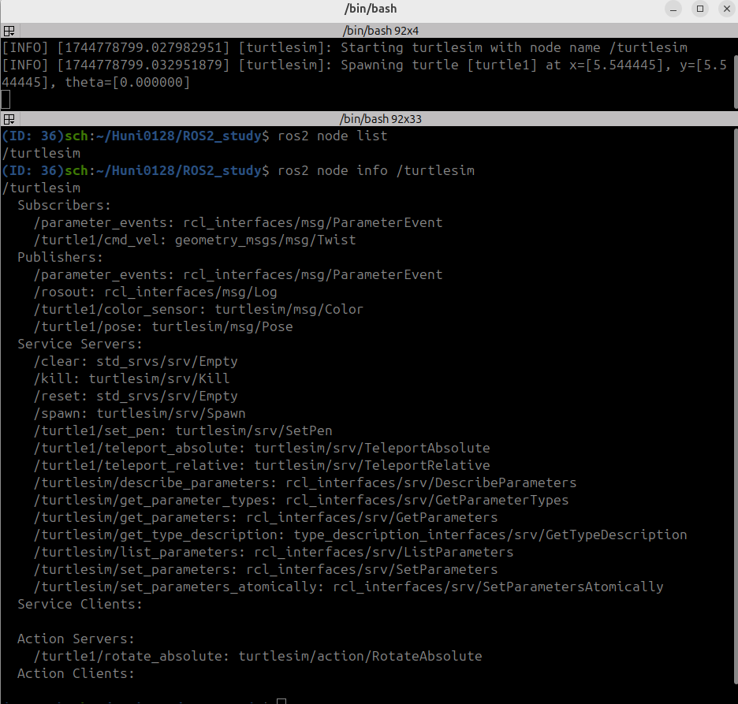
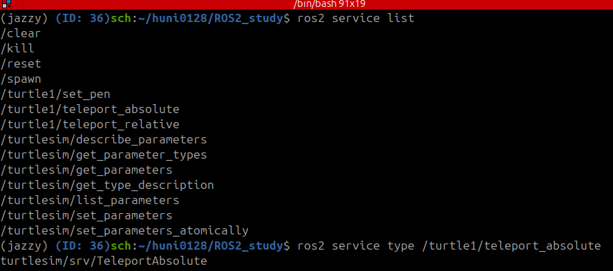
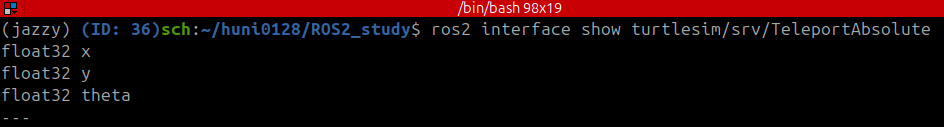
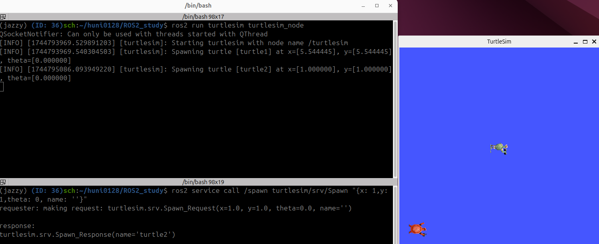
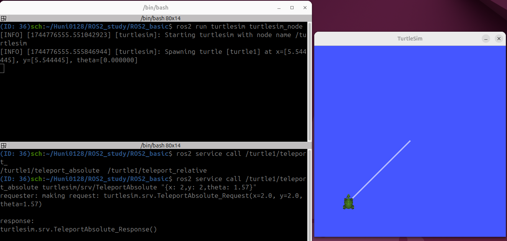
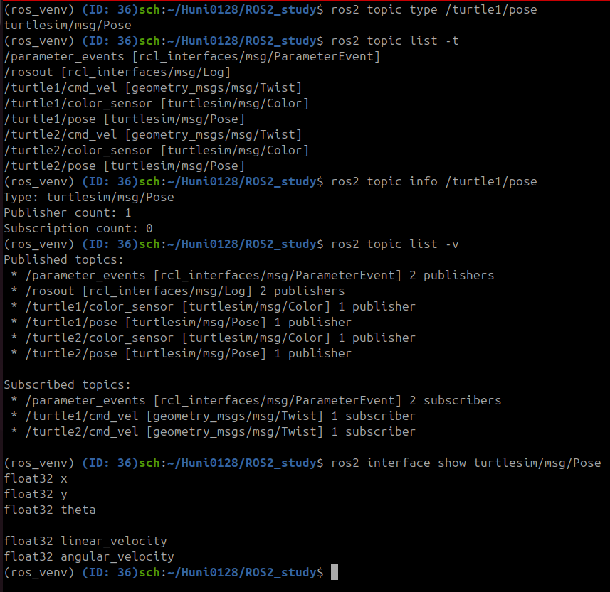
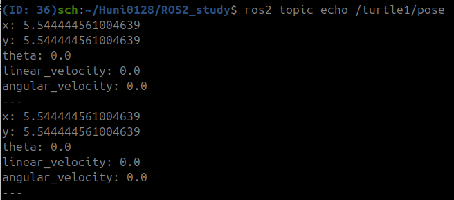
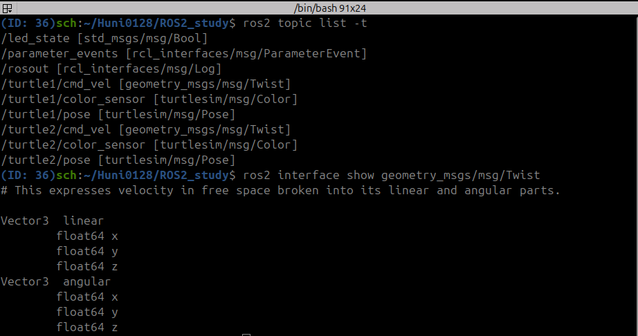
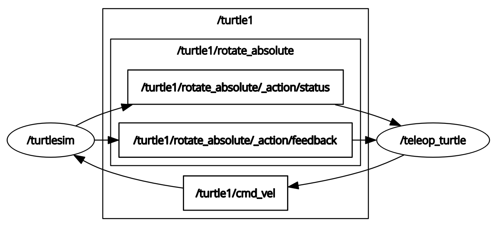
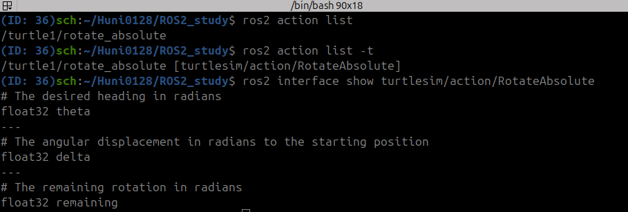

# ROS2 입문 실습

## Turtlesim install
```
sudo apt install ros-jazzy-turtlesim
```

## Turtlesim Node 실행 결과

### Node info 조회 예제
```
ros2 node list
ros2 node info /turtlesim
```


### 1_Terminal
```
ros2 run turtlesim turtlesim_node
```

### 2_Terminal
```
ros2 node list
```


## Turtlesim Service 실행 결과

### Service info 조회 예제
```
ros2 service list
ros2 service type /turtle1/teleport_absolute
```


### Interface 구조 확인
```
ros2 interface show turtlesim/srv/TeleportAbsolute
```


### Turtle2 생성: spawn service 호출 예제
```
ros2 service call /spawn turtlesim/srv/Spawn "{x: 1,y: 1,theta: 0, name: ''}"
```


### 1_Terminal
```
ros2 run turtlesim turtlesim_node
```
### 2_Terminal
```
ros2 service call /turtle1/teleport_absolute turtlesim/srv/TeleportAbsolute "{x: 2,y: 2,theta: 1.57}"
```


### Topic 및 interface 명령어 실습
```
ros2 topic list
ros2 topic type /turtle1/pose
ros2 topic list -t
ros2 topic info /turtle1/pose
ros2 topic list -v
ros2 interface show turtlesim/msg/Pose
```


### Topic message 실시간 출력
```
ros2 topic echo /turtle1/pose
```


### Twist message 구조
```
ros2 interface show geometry_msgs/msg/Twist
```


### Turtlesim topic 명령어 실행 결과
```
ros2 topic pub --once /turtle1/cmd_vel geometry_msgs/msg/Twist "{linear: {x: 2.0,y: 0.0, z: 0.0}, angular: {x: 0.0,y: 0.0,z: 0.0}}"
ros2 topic pub --once /turtle1/cmd_vel geometry_msgs/msg/Twist "{linear: {x: 2.0,y: 0.0, z: 0.0}, angular: {x: 0.0,y: 0.0,z: 1.8}}"
ros2 topic pub --rate 1 /turtle1/cmd_vel geometry_msgs/msg/Twist "{linear: {x: 2.0,y: 0.0, z: 0.0}, angular: {x: 0.0,y: 0.0,z: 1.8}}"
```


### Turtlesim keyboard 제어 결과
```
ros2 run turtlesim turtle_teleop_key
```
 


### Turtlesim 액션 명령어 실습
```
ros2 action list
ros2 action list -t
ros2 interface show turtlesim/action/RotateAbsolute
```

