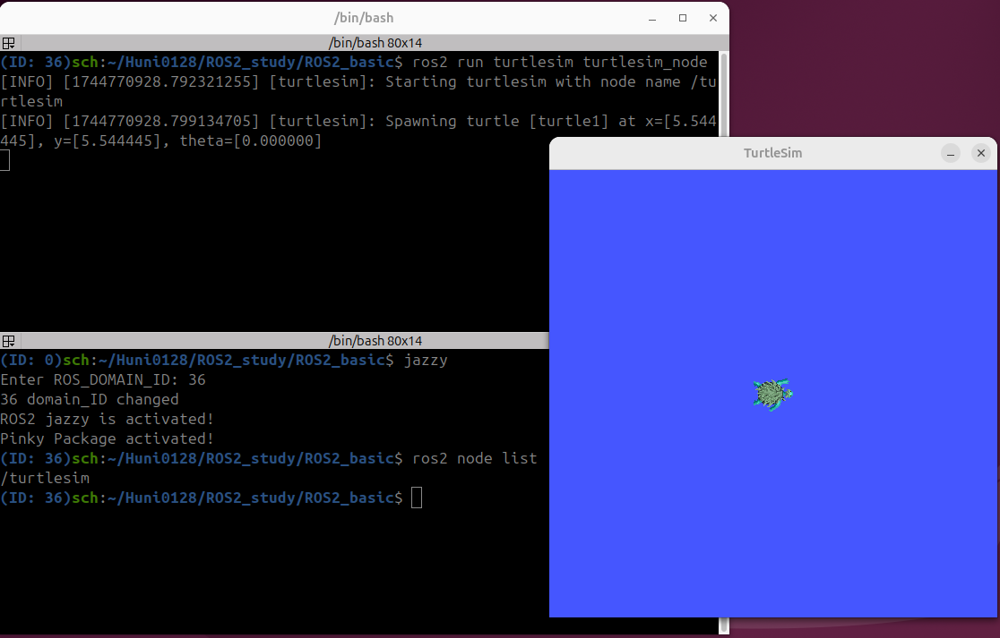
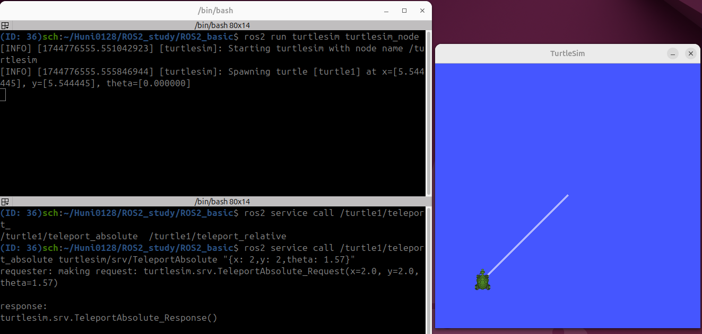

# ROS2 입문 실습

## turtlesim install
```
sudo apt install ros-jazzy-turtlesim
```

## turtlesim node 실행 결과

### 1_Terminal
```
ros2 run turtlesim turtlesim_node
```
### 2_Terminal
```
ros2 node list
```



## Turtlesim Service 실행 결과

### 1_Terminal
```
ros2 run turtlesim turtlesim_node
```
### 2_Terminal
```
ros2 service call /turtle1/teleport_absolute turtlesim/srv/TeleportAbsolute "{x: 2,y: 2,theta: 1.57}"
```



